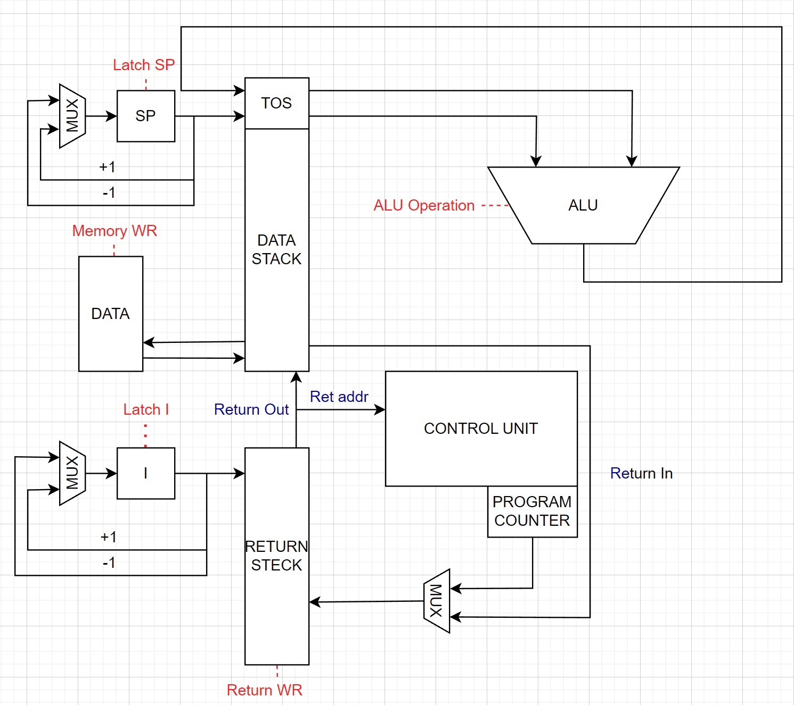
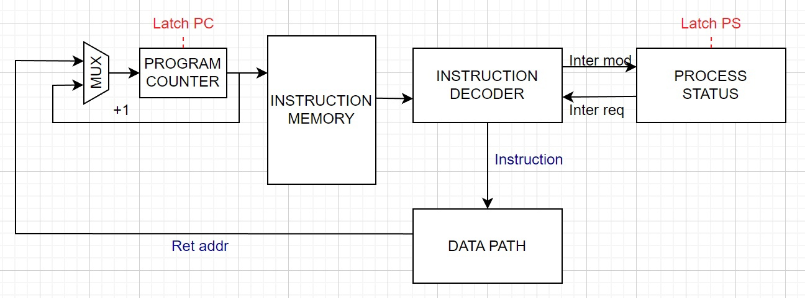
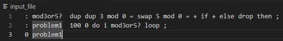
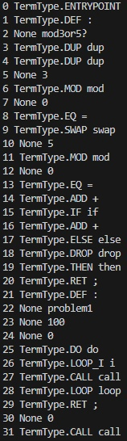
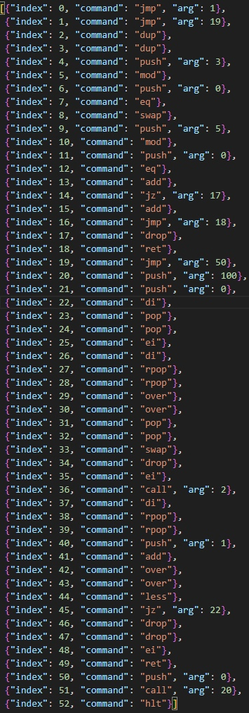
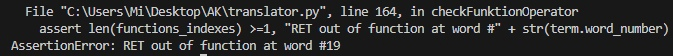
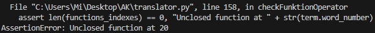
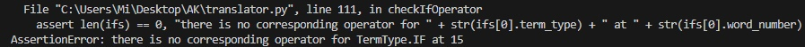
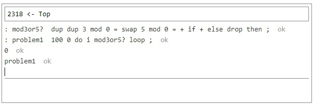

# Отчёт по лабораторной работе №3

- Выполнил: Тюрин Святослав
- Группа: P33302
- Вариант: `forth | stack | harv | hw | tick | struct | trap | mem | pstr | prob1 | spi`

  CI status

## Язык программирования

По варианту необходимо реализовать Forth-подобный язык.
  
```bnf
<program> ::= <expression>
<expression> ::= <expression> | <expression> <expression>
<expression> ::= <if-else-expression> | <do-loop-expression> | <begin-until-expression> | <words>
<if-else-expression> ::= "if " <expressions> [else <expressions>] " then"
<do-loop-expression> ::= "do " i <expressions> " loop"
<begin-until-expression> ::= "begin " <expressions> " until"
<words> ::=   <целочисленный литерал> | <math-op> | <stack-op> |<отображение строки> | <название процедуры> |
            "mod" | "key" | "." | "emit" | <переменная> | "@" | "!" | "ei" | "di" | "and" | "or" | "invert"
<math-op> ::= ">" | "<" | "=" |  "+" | "-" | “*” | “/” |
<stack-op> ::= | "drop" | "swap" | "over" | "dup"
<defun-expression> ::= ": " <название процедуры> <expressions> " ;"
<var-expression> ::= “variable ” <название переменной>
<string> ::=  "." <строка>
```
- `целочисленный литерал` - ложит значение на стек
- `math-op` - выполняет математическое действие между двумя последними значениями на стеке, вторым операндом берётся значение с вершины стека, операнды снимаются со стека, результат записывается на стек.
- `ei` -  разрешить прерывания
- `di` -  запретить прерывания
- `drop` - ( n -- ) убирает значение со стека
- `swap` -  ( n1 n2 -- n2 n1 ) меняет местами два последних значения на стеке
- `over` - ( n1 n2 -- n1 n2 n1 ) Берёт второй элемент со стека и дублирует его на вершину стека
- `dup` - ( n -- n n ) дублирует последние значение на стеке
- `.` - ( n -- ) выводит последний элемент стека на стандартный поток вывода в виде числа
- `emit` - ( n -- ) выводит последний элемент стека в стандартный поток вывода в виде символа ASCII
- `key` - ( -- n) ввод символа с потока ввода
- `@` - (n1 -- n2) прочитать значение из памяти по адрессу n1 и положить его на стек
- `!` - (n1 n2 -- ) записать значение n1 в память по адрессу n2

Булевые значения, ложное значение "0", истинное значение любое другое число, каноническая версия "-1".

Объявление переменной `variable <varName>` создаёт переменную, по varName можно получить её адресс в памяти. При добавление слова `alot` можно выделить в памяти участок определённого размера, с помощью этого можно реализовать аналог массивов в языке C.

Оператор `if` выполняется в зависимости от "истинности" значения на вершине стека. Таким образом `0 = if ." Yes!" else ." No!" then ;` эквивалентно `if(flag) {print("Yes!")} else {print("No!)}`

Цикл `do-loop` похож на циклы в других C-подобных языках, внутри тела цикла с помощью ключевого слова `i` можно положить текущие значение индекса на стек. Два верхних значения на стеке дают конечное значение (не включая) и начальное значение(включительно). Таким образом `10 0 do i . loop` эквивалентно `for (int i = 0; i < 10; i++) { print(i); }`

Цикл `begin-until` работает как цикл while, каждый раз когда встречается слово until проверяется значение на стеке, и если оно истинно то мы возвращаемся к слову begin, если ложно то выполнение продолжается. Таким образом `5 begin dup . 1 - until` эквивалентно `int i = 5; while(i != 0){ print(i); i -=1;}`

Коментарии не поддерживаются.

Память выделяется статически, при запуске модели. Видимость данных -- глобальная. Строковые литералы имееют ввид ."строка". Целочисленные литералы ложат значение на стек.

## Организация памяти
По варианту использутется гарвардская архитектура, поэтому память инструкций и память данных разделена.

Память инструкции предствляет из себя список объектов, которые описывают инструкции. Размер машинного слова команд - 40 бит, где первые 8 бит отдается под тип команды. 

Память данных - линейное адресное пространство, где одно машинное слово - 32 бит.

- В языке отсутствует константы, поэтому здесь не будут описаны.
- Числовые литералы напрямую загружаются в аккумулятор, когда они встречаются.
- Числовые и строковые литералы записываются в память во время исполнения. Для записи строк создаётся список команд во время трансляции.
- Память данных и команд выделяется статически при запуске
- Процедуры хранятся в начале памяти инструкций, основная программа будет расположена после всех процедур. Вызов процедур возможен из любой части команды.
- Существует одно прерывание(для упрощения) для реализации ввода-вывода по варианту, ему сооответствует один обработчик прерываний.
- Программисту доступен стек и память данных в виде доступа к переменным.
- Существует отдельный стек в котором хранится адресс возрата из процедур/прерываний

## Система команд
Особенности процессора:
- Машинное слово - 32 бит, знаковое
- Доступ к памяти данных осуществляется по адресу, который указан в инструкции
- Ввод/вывод осуществляется путем прерываний
- Поток управления
    - инкремент `PC` после каждой инструкции
    - условный `jz` и безусловный `jmp` переходы (использование см. в разделе транслятор).

Пример команды:
```json
{
  "instr_index": 1,
  "op_code": "add",
  "arg": 1
}
```

- `instr_index` - номер инструкции в скомпилированной программе, нужен для отладки
- `op_code` - инструкция
- `arg` - аргумент команды, может не использоваться в зависимости от команды.

### Набор инстркции

Почти все инструкции соответсвуют своему аналогу в нашем ЯП, так как могут получится путём прямой трансляции. Спецификация количества тактов и последовательность действий -- в разделе "Модель процессора".

- push arg
- add
- sub 
- mul
- div
- mod
- eq
- more
- less
- drop
- swap
- over
- dup
- emit
- read
- ld
- ST
- jmp addr
- jz addr
- call addr
- ret
- ei
- di
- hlt

## Транслятор
Процесс трансляции происходит следующим образом: 
- Каждое слово из исходной программы конвертирууется в термы 1 к 1, слова разделенны пробелами или переносом строки.
- Происходит валидация на соответсвие синтаксису нашего языка, для циклов, подпрограмм, ветвлений и переменных. В случае нарушение синтаксиса указывается номер слово, в котором произошла ошибка.
- Большинство термов прямым образом конвертируются в машинные команды, но операции работы с циклами преобразовываются в несколько машинных команд, таким образом сначала мы получаем массив массивов машинных команд, который потом последовательно преобразовываем в обычный массив
## Модель процессора
### Data Path

Помимо основного стека, используется дополнительный стек возрата причиной появления которого является:
-Необходимость сохранения адреса возрата при входе в подпрограмму, так как исходными данными для подпрограммы являются данные на основном стеке, а их количество может быть переменным.
-Необходимость реализации цикла do loop и хранение итеррируемой переменной i.
### Control Unit

## Тестирование

## CI

## Примеры
В связи с неоконченным форматом работы, считаю нужным продемонстировать результаты своего труда:
### Работа транслятора
Трансляция программы содержащей подпрограммы и циклы



Валидация неправильного синтаксиса подпрограмм, ветвлений.



### Problem1
Доказательство возможности решения задачи, с помощью конструкций нащего языка: 
"нахождение суммы чисел от 1 до 100 которые делятся на 3 или 5"

Для исполенения программы использовался проект: https://skilldrick.github.io/easyforth/ , который послужил идейным вдохновителем для выполнения этой работы.
